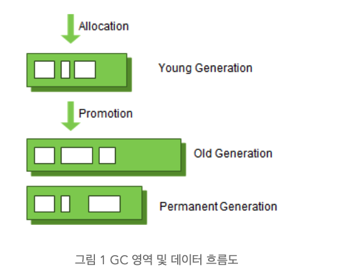
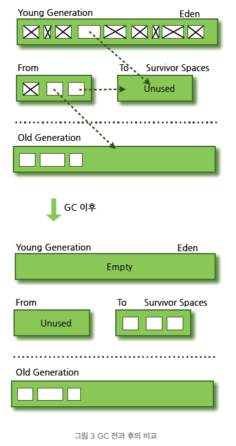
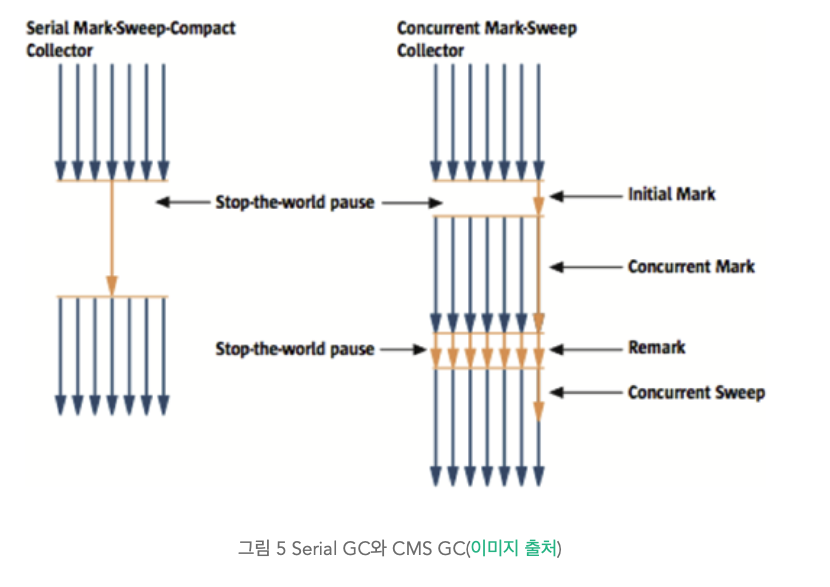
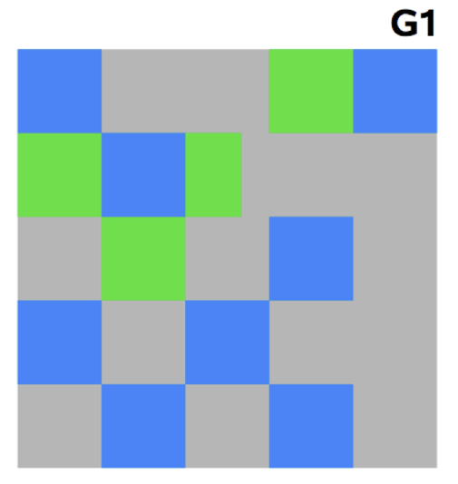

# [JAVA] JVM - GC

# GC 개요

- stop-the-world STW : GC를 실행하기 위해 JVM이 애플리케이션 작업 중단하는 현상
    - GC 실행 스레드 제외, 나머지 스레드는 작업을 중단 → GC 이후 작업 재시작
    - GC 튜닝은 STW를 줄이는 것
- Java에서는 메모리 해제를 가비지 컬렉터(GC)가 더이상 필요 없는 객체를 찾아 해제
    - weak generational hypothesis 가설 하에 만들어짐
        - 대부분의 객체는 금방 접근 불가능 상태(unreachable) 됨
        - 오래된 객체에서 젊은 객체로의 참조는 아주 적게 존재
    - HotSpot VM에서는 물리적 공간을 2가지로 나눔
        - Young 영역
            - 새롭게 생성된 객체의 대부분이 위치
            - 매우 많은 객체가 Young에서 생성 → 삭제
            - Minor GC : Young 영역에서 객체가 사라지는 경우 발생
        - Old 영역
            - Young 영역에서 살아남은 객체가 Old 영역으로 복사
            - Young 영역보다 크게 할당되며, GC는 적게 발생
            - Major GC(Full GC) : Old 영역에거 객체가 사라지는 경우 발생
    
    ## 영역별 데이터 흐름
    
    
    
    - Perm 영역
        - Method Area. 객체나 억류된 문자열 정보를 저장하는 곳
        - 해당 영역에서 GC 발생 시, Major GC의 횟수에 포함
    - 카드 테이블
        - Old 영역에 있는 객체가 Young 영역 객체를 참조하는 경우 참조하는 테이블
        - Old 영역에 있는 객체가 Young 영역의 객체 참조 시, 정보 표시
        - write barrier를 사용하여 관리.
            - write barrier : Minor GC를 빠르게 할 수 있도록 하는 장치
            - 전반적인 GC 시간을 단축

# Young 영역의 GC

- Young 영역은 3개 영역으로 구성
    - Eden 영역
    - Survivor 영역(2개)

## 처리절차

<aside>
💡 Eden → Survivor → Old 영역으로 오래 살아남은 객체가 이동

</aside>

- 객체 생성 시, Eden 영역 위치
- Eden 영역에서 GC 한 번 발생 후, 살아남은 객체는 Survivor 영역 중 하나로 이동
- 하나의 Survivor 영역이 가득 차게 되면, 그 중 살아남은 객체는 다른 Survivor 영역으로 이동
    - 가득 찬 Survivor 영역은 아무 데이터도 없는 상태로 된다.
- 이 과정을 반복하다가 살아남은 객체는 Old 영역으로 이동

## Minor GC를 통해서 Old 영역까지 데이터가 쌓이는 절차

- HotSpot VM에서 빠른 메모리 할당을 위해 두 가지 기술 사용
    - bump-the-pointer
        - Eden 영역에 할당된 마지막 객체 추적
        - 객체가 Eden 영역에 넣기 적당한 크기면 Eden 영역에 삽입
        - 새로은 객체 생성 시, 마지막 추가된 객체만 확인
        - 단, 멀티 스레드 환경에서는 Eden 영역에 여러 스레드가 저장하므로 lock 발생 → 성능 저하
            - 이를 TLABs가 해결
    - TLABs(Thread-Local Allocation Buffers)
        - 각 스레드가 각각의 몫에 해당하는 Eden 영역의 작은 덩어리를 가짐
        - 각 스레드는 자기가 할당받은 TLAB만 접근
        - bump-the-pointer 기술 사용 시에도 락 없이 메모리 할당 가능

# Old 영역에 대한 GC

- 데이터가 가득 차면 GC 실행
- JDK 7 기준, 5가지 방식 존재
    - Serial GC → 운영 서버에서 사용 불가, CPU 코어가 싱글인 경우에만 사용하기 위한 방식
    - Parallel GC
    - Parallel Old GC(Parallel Compacting GC)
    - Concurrent Mark & Sweep GC(이하 CMS)
    - G1(Garbage First) GC

## Serial GC(-XX:+UseSerialGC)

- Old 영역 GC는 mark-sweep-compact 알고리즘 사용
- mark-sweep-compact 알고리즘
    1. Mark : Old 영역에 살아 있는 객체 식별
    2. Sweep : heap 앞 부분부터 확인하여 살아 있는 것만 남김
    3. Compaction : 힙의 가장 앞부분부터 채워서 객체가 존재하는 부분과 존재하지 않는 부분으로 나눔
- 적은 메모리와 CPU 코어 개수가 적을 때 적합한 방식

## Parallel GC (-XX:+UseParallelGC)

- Serial GC 와 기본적인 알고리즘은 동일하나 여러 스레드가 GC를 수행
- 메모리, CPU 코어 수가 많을 경우 유리

## Parallel Old GC(Parallel Compacting GC)

- Parallel GC 와 비교하여 Old 영역의 GC 알고리즘만 다름
- Mark-Summary-Compaction 알고리즘 사용
    - Summary : 앞서 GC 수행한 영역에 대해서 별도로 살아 있는 객체 식별
        - Sweep과 다르며, 약간 더 복잡한 절차를 수행

# **CMS GC (-XX:+UseConcMarkSweepGC)**

## Serial GC VS CMS GC

- 초기 Inital Mard 단계 : 클래스 로더에서 가장 가까운 객체 중 살아 있는 객체만 탐색
- Concurrent Mark 단계 : 살아 있다 확인한 객체에서 참조하고 있는 객체들을 따라다니면서 확인
    - 다른 스레드가 실행 중인 상태에서 동시 진행
- Remark 단계 : Concurrent Mark 단계에서 새로 추가되거나, 참조가 끊긴 객체 확인
- Concurrent Sweep 단계 : 쓰레기 정리 작업
    - 다른 스레드가 실행되고 있는 상황에서 진행
- STW 시간이 매우 짧기에, 모든 애플리케이션의 응답 속도가 매우 중요할 때, CMS GC 사용
    - Low Latency GC라고도 부름
- 다만, 아래 단점이 존재
    - 다른 GC 방식보다 메모리와 CPU가 더 많이 사용
    - Compaction 단계가 기본적으로 제공 X
    - 조각난 메모리가 많음 → Compaction 실행 시, STW 시간이 더 오래걸림

# G1(Garbage First) GC

- 바둑판의 각 영역에 객체를 할당하고 GC를 실행
- 해당 영역이 꽉 차면 다른 영역에서 객체 할당하고 GC 실행
- Young의 세 가지 영역에서 데이터가 Old 영역으로 이동하는 단계가 사라진 GC 방식으로 CMS GC를 대체하기 위해 만들어짐
    
    
    
- 장점
    - 다른 GC 알고리즘보다 성능이 우수함

---

# 참고문헌

[Java Garbage Collection](https://d2.naver.com/helloworld/1329)
