# [JAVA] JVM Java Virtual Machine

# JVM Java Virtual Machine의 역할

- 자바 바이트코드는 JRE 위에서 동작함
- JRE에서 가장 중요한 요소는 자바 바이트코드를 해석하는 JVM Java Virtual Machine
- JRE는 자바 API와 JVM으로 구성
    - JVM의 역할은 자바 애플리케이션을 클래스 로더 Class Loader를 통해서 읽어들여, 자바 API와 함께 실행

# 가상머신

- 자바 바이트코드를 실행할 수 있는 주체
- JVM의 존재로 인해, CPU나 OS에 독립적으로 동작
    - 자바는 WORA(Write Once Run Anywhere)를 구현하기 위해 물리적인 머신과 별개의 가상 머신을 기반으로 동작하도록 설계됨
    - 자바 바이트코드를 실행하고자 하는 모든 하드웨어에 JVM을 동작시킴으로써 자바 실행 코드를 변경하지 않고 모든 종류의 하드웨어에서 동작

## JVM의 특징

- 스택 기반의 가상 머신
    - 인텔 X86, ARM 아키텍처가 레지스터 기반으로 동작하나, JVM은 스택 기반으로 동작함
- 심볼릭 레퍼런스
    - 기본 자료형을 제외한 모든 타입을 명시적인 메모리 주소 기반의 레퍼런스가 아니라 심볼릭 레퍼런스를 통해 참조
- 가비지 컬렉션
    - 클래스 인스턴스는 사용자 코드에 의해 명시적으로 생성되고, 가비지 컬렉션에 의해 자동으로 파괴
- 플랫폼의 독립성 보장
    - JVM은 기본 자료형을 명확히 정의하여 호환성 유지, 플랫폼 독립성 보장
- 네트워크 바이트 오더 network byte order
    - 자바 클래스 파일은 네트워크 바이트 오더를 사용
        - 바이트 오더 : 시스템이 어떠한 데이터를 표현하는 방법
            - 인텔 x86 : 빅 앤디안
            - ARM : 리틀 앤디안
        - 네트워크 바이트 오더는 빅 앤디안 방식으로, 리틀 앤디안 방식의 바이트 오더는 데이터 송수신 시, 변경 필요

# 자바 바이트코드

- JVM은 자바 바이트코드를 실행하는 실행기
- 자바 컴파일러는 고수준의 언어인 자바 언어를 기계어로 변환하지 않고, JVM이 이해할 수 있는 자바 바이트코드로 변환
    - 중간 변환과정이 존재하기 때문에, JVM이 설치된 장비라면 CPU나 운영체제가 다르더라도 실행 가능
- 클래스 파일 자체는 바이너리 파일이므로 개발자가 이해하기 어려우며, 이를 보완하기 위해 JVM 벤더들은 javap라고 하는 역 어셈블러를 제공
- 역 어셈블러를 통해서 변환할 경우 결과물
    
    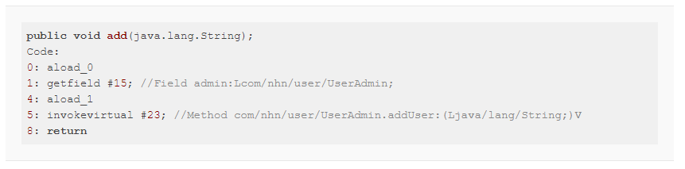
    
    - addUser() 메서드를 호출하는 부분은 4번째 줄인 5:invokevirtual #23
        - 23번 인덱스에 해당하는 메서드 호출
        - 23번 인덱스의 메서드는 javap 프로그래밍 주석을 달아줌
        - invokevirtual은 자바 바이트코드에서 사용하는 OpCode(Operation code)
        - 아래는 자바 바이트코드에서 메서드를 호출하는 OpCode
            - invokeinterface: 인터페이스 메서드 호출
            - invokespecial: 생성자, private 메서드, 슈퍼 클래스의 메서드 호출
            - invokestatic: static 메서드 호출
            - invokevirtual: 인스턴스 메서드 호출
        - 자바 바이트코드에서 코드 표현
            
            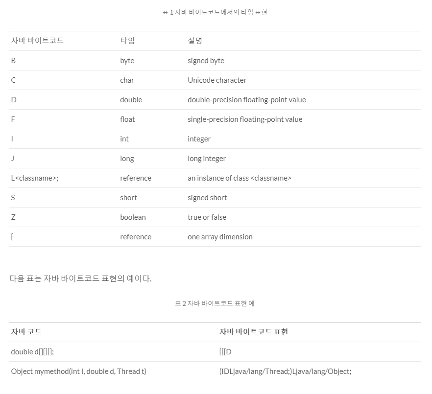
            

# 자바 코드 실행 절차 및 JVM의 구조

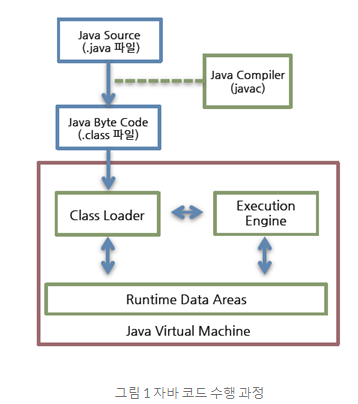

## 자바 코드 실행 절차

1. 자바 소스코드를 자바 컴파일러가 자바 바이트코드로 변환
2. 클래스 로더 Class Loader가 컴파일된 자바 바이트코드를 런타임 데이터 영역 Runtime Data Areas에 로드하고
3.  실행 엔진 Excution Engine이 자바 바이트코드를 해석한다.

## 클래스 로더 Class Loader

- 자바는 동적 로드 지향하며, 이를 클래스 로더에서 담당
- 자바의 .class 파일을 묶어서 JVM의 메모리 영역인 Runtime Data Area로 적재

### 클래스 로더의 특징

- 계층 구조
    - 클래스 로더끼리 부모-자식 관계를 이루어 계층 구조로 생성
    - 최상위 클래스 로더는 부트스트랩 클래스 로더
- 위임 모델
    - 계층 구조를 바탕으로 클래스 로더끼리 로드를 위임
    - 클래스 로드 시, 상위 클래스 로더를 확인하여, 상위 클래스 로더에 있다면 해당 클래스를 사용. 없을 경우 요청받은 클래스 로더가 클래스를 로드
- 가시성 제한
    - 하위 클래스 로더는 상위 클래스 로더의 클래스를 찾을 수 있음
    - 상위 클래스 로더는 하위 클래스 로더를 찾을 수 없음
- 언로드 불가
    - 클래스 로더는 클래스를 로드할 수 있지만, 언로드할 수 없음
    - 언로드 대신, 현재 클래스 로더를 삭제하고 새로운 클래스 로더를 생성할 수 있음

### 클래스 로더 위임 모델

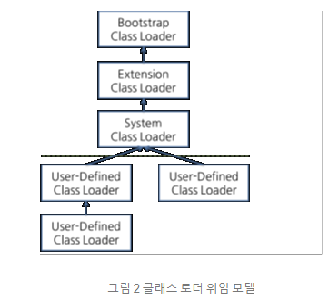

- 클래스 로더가 클래스 요청을 수행 절차
    - 클래스 로더 캐시에 로드된 클래스가 있는지 확인
    - 상위 클래스 로더에 로드된 클래스가 있는지 확인
    - 부트스트랩 클래스 로더까지 확인해도 존재하지 않을 경우, 요청 받은 클래스 로더가 파일 시스템에서 해당 클래스를 찾음
- 클래스 로더의 종류
    - 부트스트랩 클래스 로더
        - JVM이 기동할 때 생성.
        - Object 클래스를 비롯하여 자바 API를 로드
        - 자바가 아니라 네이티브 코드로 구현
    - 익스텐션 클래스 로더
        - 기본 자바 API를 제외한 확장 클래스들을 로드
        - 다양한 보안 확장 기능 등을 여기서 로드
    - 시스템 클래스 로더
        - 애플리케이션의 클래스들을 로드
        - 사용자가 지정한 클래스패스의 클래스들을 로드
    - 사용자 정의 클래스 로더
        - 애플리케이션 사용자가 직접 코드 상에서 생성해서 사용하는 클래스 로더
- 클래스 로더가 로드할 클래스를 찾으면, 아래와 같은 과정을 거쳐서 클래스 로드 → 링크 → 초기화 진행
    
    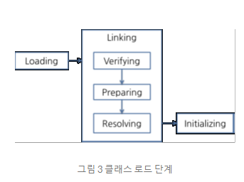
    
    - 로드
        - 클래스 파일을 가져와서 JVM 메모리에 로드
    - 검증 Verifying
        - 로드된 클래스가 자바 언어 명세 및 JVM 명세에 명시된 대로 잘 구성되어 있는지 검사
        - 가장 복잡하고, 시간이 많이 소요됨
    - 준비 Preparing
        - 클래스가 필요로 하는 메모리를 할당
        - 클래스에서 정의된 필드, 메서드, 인터페이스들을 나타내는 데이터 구조 준비
    - 분석 Resolving
        - 클래스의 상수 풀 내 모든 심볼릭 레퍼런스를 다이렉트 레퍼런스로 변경
    - 초기화
        - 클래스 변수들을 적절한 값으로 초기화
            - static initializer들을 수행하고, static 필드들을 설정된 값으로 초기화

## 런타임 데이터 영역 Runtime Data Areas

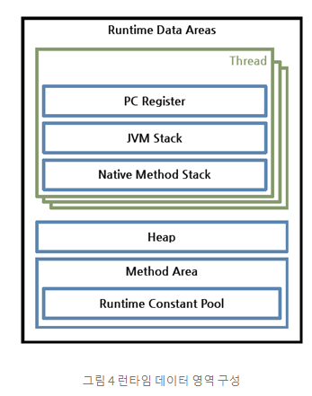

- JVM이 OS에서 할당 받은 메모리 영역
- 런타임 데이터 영역은 6개의 영역으로 분할 가능
    - PC 레지스터, JVM 스택, 네티이브 메서드 스택은 스레드마다 하나씩 생성
    - 힙, 메서드 영역, 런타임 상수 풀은 모든 스레드가 공유
- PC 레지스터
    - 각 스레드마다 하나씩 존재
    - 현재 수행 중인 JVM 명령의 주소를 가짐
- JVM 스택
    - 스레드마다 하나씩 존재하며, 스레드가 시작될 때 생성
    - 스택 프레임이라는 구조체를 저장하는 스택
        - JVM은 JVM 스택에 스택 프레임을 추가하고 저장하는 동작만 수행
        
        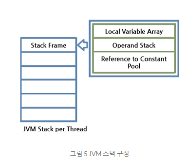
        
- 스택 프레임
    - JVM 내에서 메서드가 수행될 때마다 하나의 스택 프레임 생성되어 해당 스레드의 JVM 스택에 추가
    - 스택 프레임의 구조
        - 지역 변수 배열 Local Variable Array
            - 0부터 시작하는 인덱스를 가진 배열
            - 0은 클래스 인스턴스의 this 인스턴스
            - 1부터는 메서드에 전달된 파라미터들이 저장
            - 메서드 파라미터 이후, 메서드의 지역 변수가 저장
        - 피연산자 스택 Operand Stack
            - 메서드의 실제 작업 공간
            - 피연산자 스택과 지역 변수 배열 사이에서 데이터를 교환
            - 다슨 메서드 호출 결과를 추가하거나 꺼냄
            - 컴파일 시 피연산자 스택의 크기 결정
        - 상수 풀 레퍼런스 Reference to Constant Pool
- 네이티브 메서드 스택
    - 자바 외의 언어로 작성된 네이티브 코드를 위한 스택
    - JNI Java Native Interface를 통해 호출하는 C/C++ 등의 코드를 수행하기 위한 스택
    - 언어에 맞게 C, C++ 스택이 생성
- 메서드 영역
    - 모든 스레드가 공유
    - JVM이 시작할 때 생성
    - JVM이 읽어 들인 각각의 클래스와 인터페이스에 대한 런타임 상수 풀, 필드와 메서드 정보, Static 변수, 메서드의 바이트코드 등을 보관
- 런타임 상수 풀
    - 메서드 영역에 포함되는 영역이나, JVM의 동작에 가장 핵심적인 역할을 수행
        - JVM 명세에서도 따로 기술
    - 각 클래스와 인터페이스의 상수 뿐 아니라 메서드와 필드에 대한 모든 레퍼런스를 담고 있는 테이블
    - 어떤 메서드나 필드를 참조할 때, JVM은 런타임 상수 풀을 통해서 실제 메모리 주소를 찾아 참조
- 힙
    - 인스턴스 또는 객체를 저장하는 공간
    - 가비지 컬랙션 대상
- 역 어셈블된 바이트코드
    
    
    
    - JVM은 자체적으로 메모리를 관리하기 때문에, 실제 메모리 주소 대신, 15, 23과 같은 인덱스 번호 사용
        - 15, 23은 상수 풀의 인덱스
        - JVM은 각 클래스마다 상수 풀을 생성하며, 실제 대상의 레퍼런스를 보관하고 있음
    - 역 어셈블된 코드의 각 줄에 대한 해석과 도식화
        
        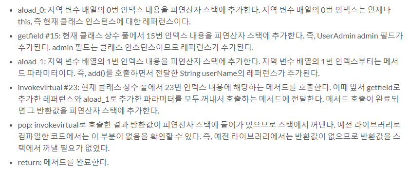
        
        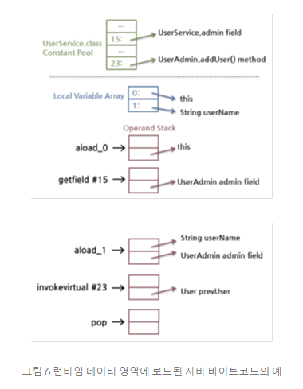
        

## 실행 엔진

- 클래스 로더에 의해 JVM 런타임 데이터 영역에 배치된 바이트코드를 실행
- 자바 바이트코드를 명령어 단위로 읽어서 실행
- 자바 바이트코드를 먼저 기계어로 번역
    - 인터프리터
        - 바이트코드 명령어를 하나씩 읽어서 해석
        - 바이트코드 하나하나의 해석은 빠르나, 인터프리팅 결과는 느림
        - 바이트코드 언어는 기본적으로 인터프리터 방식
    - JIT Just-In-Time
        - 인터프리터 방식의 보완
        - 인터프리터 방식으로 실행하다, 적절한 시점에 바이트코드 전체를 컴파일하여 네이티브 코드로 변경
        - 이후 해당 메서드는 네이티브 코드로 직접 실행
            - 네이티브 코드는 캐시에 보관
- JIT 컴파일러를 사용하는 JVM은 내부적으로 해당 메서드의 실행 주기를 체크하여, 일정 정도를 웃돌 경우만 컴파일을 수행
    
    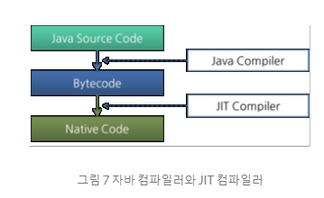
    
    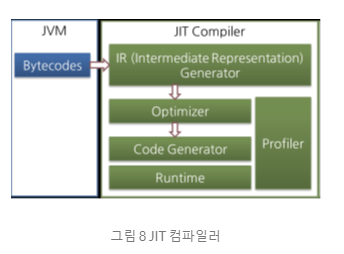
    
    - JIT 컴파일러는 바이트코드를 중단 단계인 IR Intermediate Representation로 변환하여 최적화 수행 후 네티이브 코드 생성

# 참고

## JVM 메서드 제한

- JVM에서 하나의 메서드 크기가 65535 바이트를 넘을 수 없다.

---

# 참고문헌

[NAVER D2](https://d2.naver.com/helloworld/1230)
